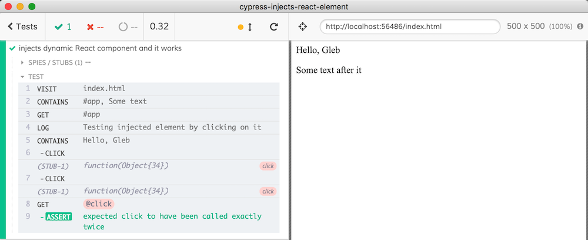

> Inject a dynamic JSX element from Cypress spec into application

See [cypress/integration/spec.js](cypress/integration/spec.js) but in a nutshell

- you can use JSX inside Cypress specs, just make sure to require React

```js
// spec.js
const React = require('react')
const Welcome = (props) =>
  <p onClick={props.onClick}>Hello, {props.name}</p>
```

- you can mount React component _from spec_ into application

```js
// spec.js
const ReactDOM = require('react-dom')
cy.get('#app').then(el$ => {
  const welcomeGleb = <Welcome name="Gleb"/>
  ReactDOM.render(welcomeGleb, el$[0])
})
```

- you can pass Cypress Sinon stub as a property and make assertions against it

```js
// spec.js
const onClick = cy.stub().as('click')
cy.get('#app').then(el$ => {
  const welcomeGleb = <Welcome name="Gleb" onClick={onClick} />
  ReactDOM.render(welcomeGleb, el$[0])
})

cy.log('Testing injected element by clicking on it')
// notice that we are using text that is created by `welcomeGleb` element
cy.contains('Hello, Gleb').click().click()
cy.get('@click').should('have.been.calledTwice')
```

and this crazy contraption works


